<p align="center">
  
</p>

<h1 align="center">Work Repote</h1>

<p align="center">
  <strong>A local-first personal Work Repote tool that records context, helps you review your day, and generates daily reports.</strong>
</p>

<p align="center">
  Automatically organizes the apps you used, websites you visited, window titles, usage time, and optional screenshots into a timeline you can review, analyze, and ask questions about.
</p>

<p align="center">
  All data is stored locally by default and never uploaded to any server. AI features are entirely optional; the app works fine with them turned off.
</p>

<p align="center">
  <strong>🔒 For personal use only — all data stays on your device.</strong>
</p>

<p align="center">
  <strong>English</strong> · <a href="./README.zh.md">简体中文</a> · <a href="./README.tw.md">繁體中文</a>
</p>

<p align="center">
  <a href="https://github.com/w0xking/Work-Review/releases/latest">
    
  </a>
  
  
  
</p>

---

## What It Solves

Work Review is designed for personal work review and helps answer questions like these:

- What did I actually do today?
- What have I been focusing on over the past few days?
- Roughly how much time did a particular task take?
- Which pages, windows, and context did I look at back then?
- How can I quickly put together today's daily report?

The focus is not "monitoring". It is helping you **recall, organize, and review** your own work process.

---

## Core Capabilities

- **Automatic work context recording** — Records foreground apps, browser pages, window titles, usage time, optional screenshots, and OCR text, reducing manual note-taking
- **Unified timeline and statistics** — Overview, timeline, work assistant, and daily report share the same local records, so you can inspect trends and drill into context
- **Questions over local records** — Use the basic template or your configured model to answer "What did I do today?", "How long did this task take?", and "What have I been focused on?"
- **Daily report generation and export** — Generate structured daily reports with Markdown export, auto-export, paragraph editing, pin/hide controls, and cached AI section ordering
- **Privacy-first and locally controllable** — Data is stored in local SQLite by default; AI is optional, and model calls use your own API key without third-party relay
- **Desktop Avatar Beta** — Shows work status through a desktop avatar and is gradually expanding toward proactive reminders and context assistance

---

## Interface Preview

The screenshots below are captured from the running desktop app with localized UI and representative local data, covering the main workflow and configuration surfaces.

### Core Workflow

<p align="center">
  
</p>

<p align="center"><strong>Overview</strong></p>
<p align="center">
  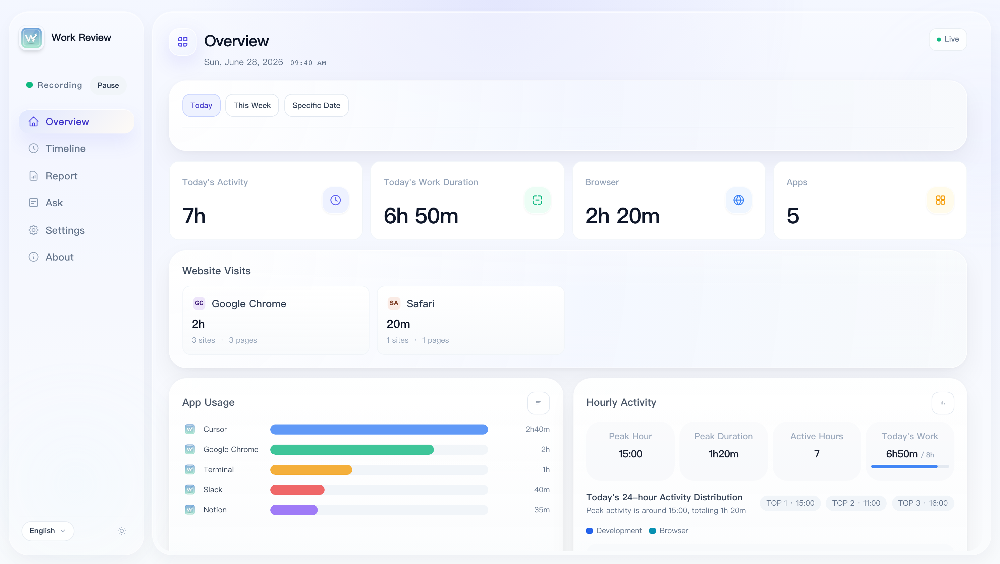
</p>

<p align="center"><strong>Timeline</strong></p>
<p align="center">
  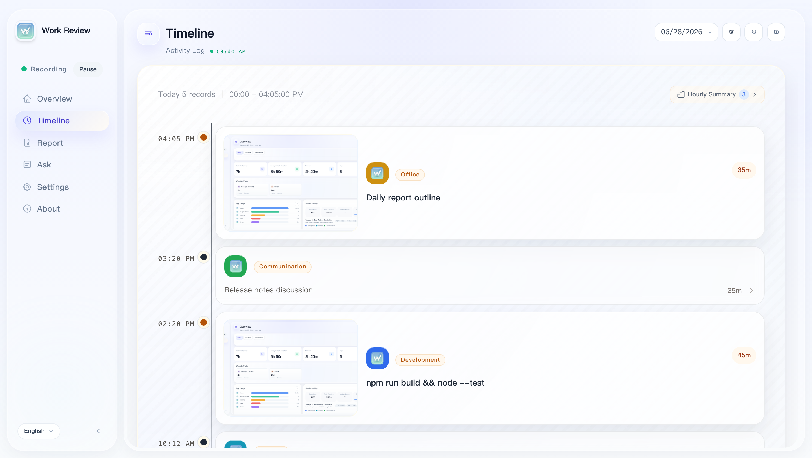
</p>

<p align="center"><strong>Timeline Detail</strong></p>
<p align="center">
  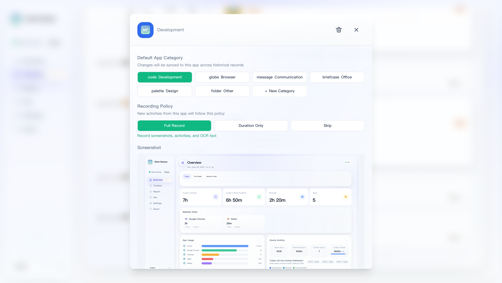
</p>

<p align="center"><strong>Daily Report</strong></p>
<p align="center">
  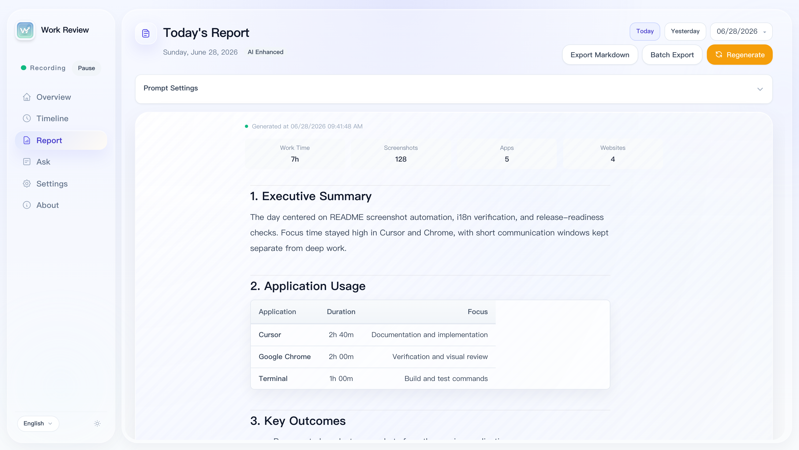
</p>

<p align="center"><strong>Work Assistant</strong></p>
<p align="center">
  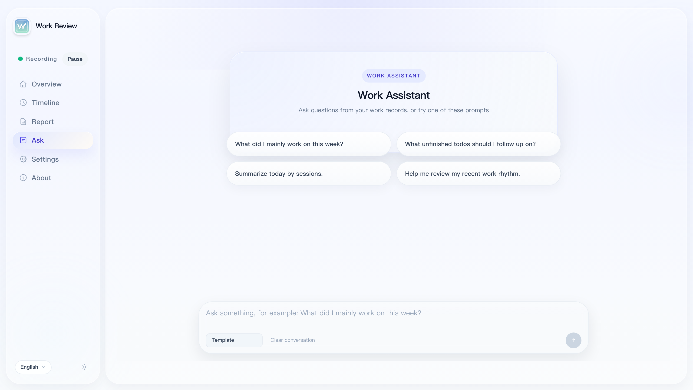
</p>

<p align="center"><strong>Integrations</strong></p>
<p align="center">
  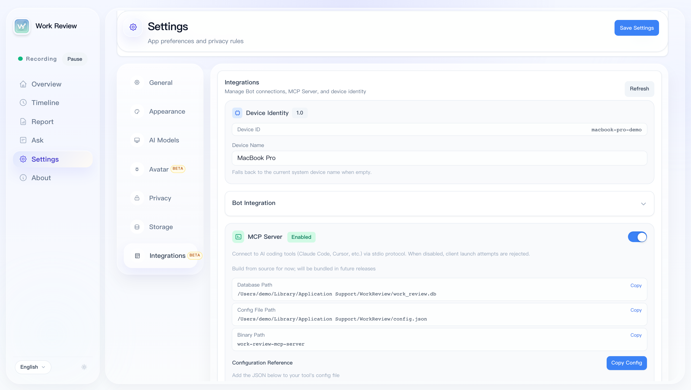
</p>

<details>
<summary>More screenshots: summaries, settings, and about page</summary>

<p align="center"><strong>Hourly Summary</strong></p>
<p align="center">
  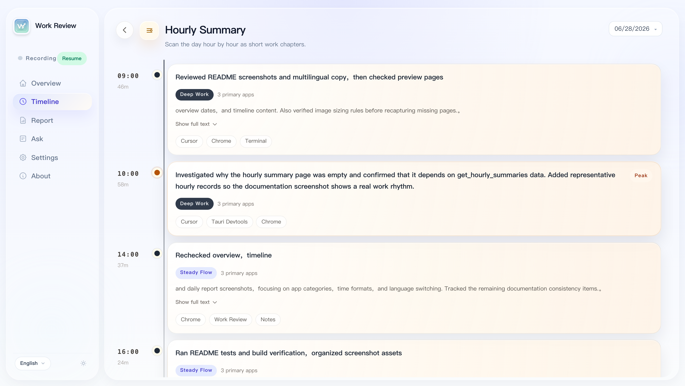
</p>

<p align="center"><strong>General Settings</strong></p>
<p align="center">
  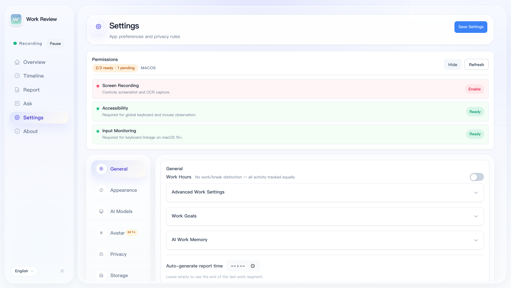
</p>

<p align="center"><strong>Appearance</strong></p>
<p align="center">
  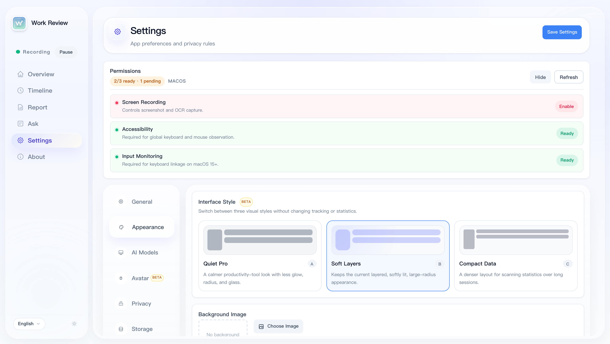
</p>

<p align="center"><strong>AI Models</strong></p>
<p align="center">
  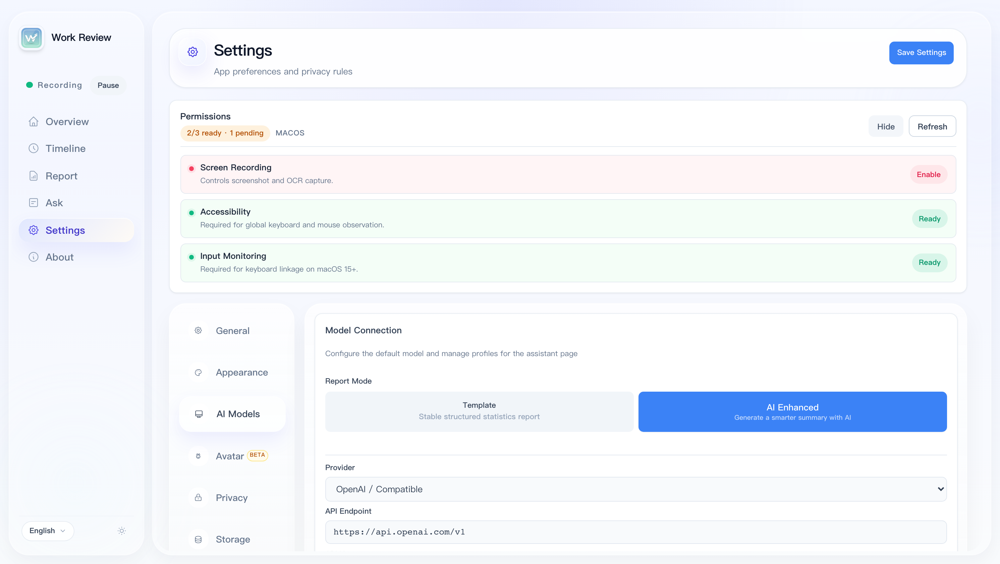
</p>

<p align="center"><strong>Desktop Avatar</strong></p>
<p align="center">
  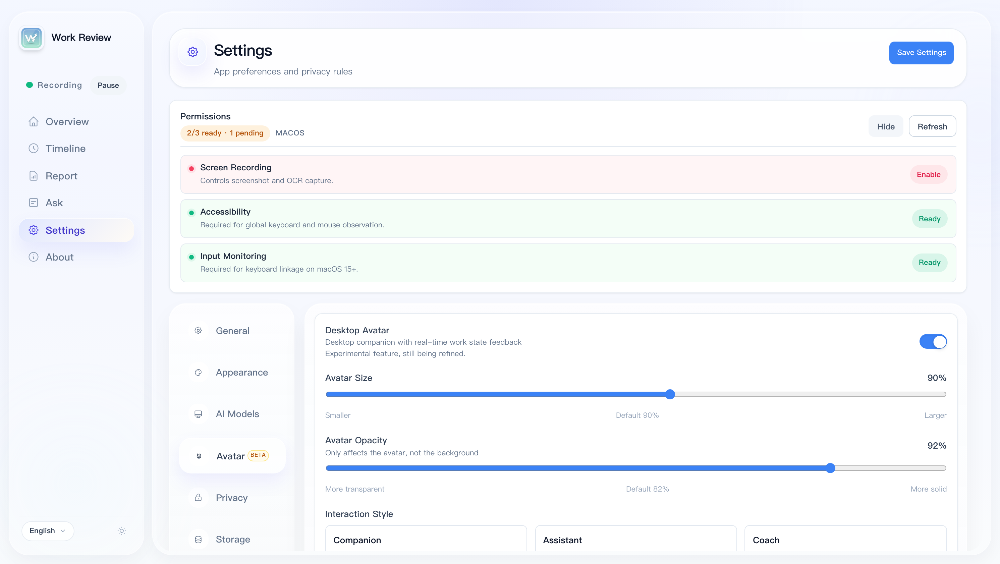
</p>

<p align="center"><strong>Privacy</strong></p>
<p align="center">
  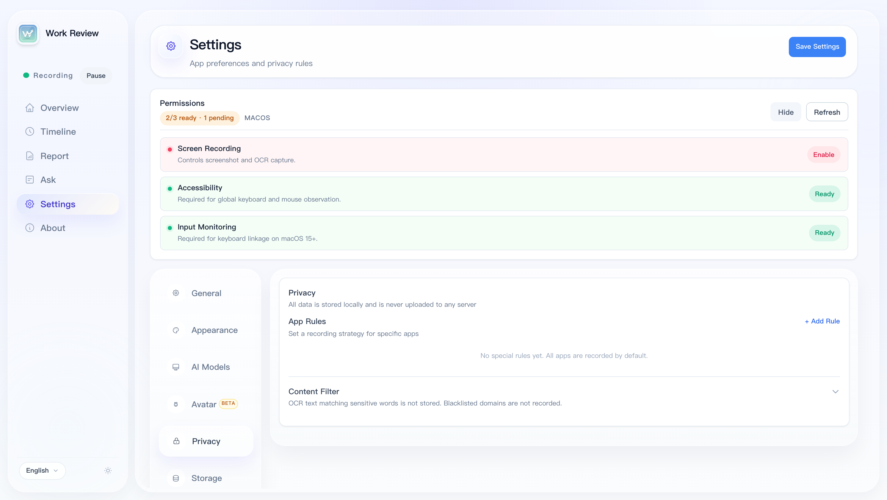
</p>

<p align="center"><strong>Storage</strong></p>
<p align="center">
  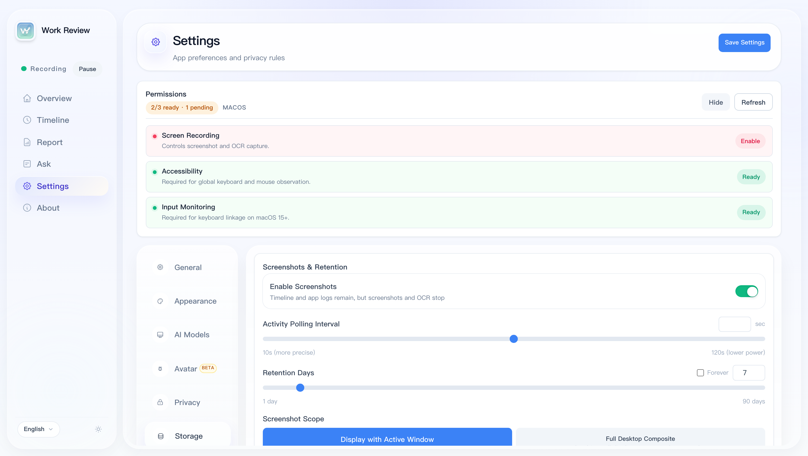
</p>

<p align="center"><strong>About</strong></p>
<p align="center">
  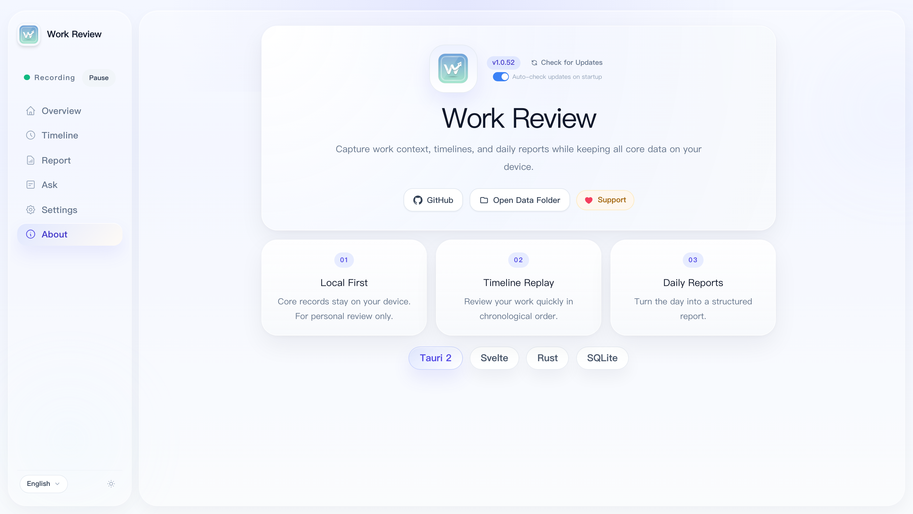
</p>

</details>

---

## Privacy and Boundaries

Work Review is designed for personal use from the ground up. It is not intended for: employee monitoring · team attendance · performance evaluation · covert tracking

You can control the recording scope as needed:

- Per-app settings: Normal / Anonymize / Ignore — anonymize mode automatically skips screenshots and OCR
- Automatic sensitive keyword filtering · domain blacklist
- Auto-pause on screen lock · manual pause/resume
- AI only activates after you configure a model; disabled by default

---

## Feature Overview

### Automatic Recording

- Foreground apps, window titles, browser URLs, usage duration, and category records
- Optional screenshots and OCR with multi-display strategies
- Keyboard/mouse activity + screen-change idle detection to reduce false records
- Timeline review for pages, windows, and context from any time period

### Smart Organization

- Work assistant based on local records, with basic template, AI-enhanced modes, and dynamic opening prompts after a model is configured
- Duration statistics, category filtering, trend comparison, natural-language time ranges, and hourly activity across Today, Week, Date, and Range views
- Fragments grouped into continuous work sessions
- Extracts potential follow-up to-dos from pages, window titles, and context

### Daily Reports and Review

- Structured daily reports, historical review, Markdown export, and auto-export
- Report blocks for hourly activity, time distribution, app usage, website visits, and more
- Paragraph-level pin/hide/restore controls, with cached AI section ordering
- AI-enhanced prompt attachments and custom model settings
- Website semantic categorization: changing a domain category automatically backfills history
- Multi-segment work time: e.g. morning + afternoon, break time excluded

---

## AI Modes

The core of Work Review is always **local recording**. AI's role is to make records easier to read and review, not a prerequisite for usage.

| Mode | Description |
|------|------|
| **Basic Template** | Zero configuration, outputs stable structured results |
| **AI Enhanced** | Calls your self-configured model service for more natural Q&A and summaries |

Supported providers: Ollama (local) / OpenAI compatible / DeepSeek / Qwen / Zhipu / Kimi / Doubao / MiniMax / SiliconFlow / Gemini / Claude

---

## Quick Start

1. Download the installer for your platform from [Releases](https://github.com/w0xking/Work-Review/releases/latest)
2. On macOS, grant Screen Recording and Accessibility permissions
3. Let it run in the background for a while
4. Check the Overview / Timeline / Daily Report to see your recorded activity

| Platform | Installer |
|------|--------|
| macOS (Apple Silicon / Intel) | `.dmg` |
| Windows | `.exe` / portable `.zip` |
| Linux x86_64 (X11 / Wayland) | `.deb` / `.AppImage` |
| Linux ARM64 (aarch64) | `.deb` |

**macOS:** Screenshots require the "Screen Recording" permission, and avatar linkage requires "Accessibility + Input Monitoring". If you see a "damaged" warning on first launch: `sudo xattr -rd com.apple.quarantine "/Applications/Work Review.app"`

**Windows:** Depends on Microsoft Edge WebView2 Runtime.

**Linux:** Screenshots and window tracking depend on the current session type and toolchain. <details><summary>Dependency details</summary>

```bash
# Base
sudo apt install xprintidle tesseract-ocr
# X11
sudo apt install xdotool x11-utils scrot
# Wayland: gdbus (GNOME) / kdotool (KDE) / swaymsg (Sway) / hyprctl (Hyprland)
# Screenshots: grim / gnome-screenshot / spectacle
```

</details>

Ubuntu 24.04 / 24.10 Wayland (GNOME 46–47) users experiencing screenshot flash or shutter sound can use the one-click install script to fix it automatically:

```bash
bash scripts/deb/reinstall.sh           # deb method (recommended)
bash scripts/deb/reinstall.sh --dry-run # preview operations
```

See [scripts/ubuntu-wayland-README.md](scripts/ubuntu-wayland-README.md) for details.

**KDE Plasma / Wayland startup crash (Fedora, Arch, openSUSE, …):** If the app quits immediately with `Gdk-Message: Error 71 (Protocol error) dispatching to Wayland display.`, it is an upstream webkit2gtk/GTK bug on Wayland (see [tauri#10702](https://github.com/tauri-apps/tauri/issues/10702)), most common on KDE Plasma + NVIDIA. Recent builds already inject `WEBKIT_DISABLE_DMABUF_RENDERER=1` at startup. If you still hit it on an older build, launch it with the same workaround manually:

```bash
WEBKIT_DISABLE_DMABUF_RENDERER=1 ./Work_Review
```

If that still fails, force the X11 backend as a last-resort fallback. This may render worse on some Wayland desktops:

```bash
GDK_BACKEND=x11 ./Work_Review
```

---

## Extended Capabilities (Beta)

<details>
<summary>Desktop Avatar</summary>

Uses a standalone desktop pet window to reflect idle / working / reading / meeting / music / video states.


Still being actively refined — interaction linkage, state expression, and preset details will continue to improve.

</details>

<details>
<summary>Bot Integration (Telegram / Feishu)</summary>

Query records and generate daily reports remotely from Telegram / Feishu via local API + multi-device registration. Supported commands: `/devices`, `/report`, `/generate`, etc. Restricted to personal and own multi-device use only.

</details>

<details>
<summary>Localhost API</summary>

After Localhost API is enabled, the app exposes a local HTTP API (default `127.0.0.1:47831`), authenticated with a Bearer Token (auto-generated on first launch, saved in `localhost_api_token.txt` in the data directory).

### Authentication

All requests (except `/health` and Feishu callbacks) must carry the token:

```
Authorization: Bearer <token>
```

Or via query parameter: `?token=<token>`

### Endpoints

| Method | Path | Description |
|------|------|------|
| GET | `/health` | Health check (no auth) |
| GET | `/v1/device` | Device info |
| GET | `/v1/timeline/{date}` | Timeline (`date` format `YYYY-MM-DD`, supports `?limit=&offset=`) |
| GET | `/v1/activities/{date}` | Activity list (supports `?limit=&offset=&category=`) |
| GET | `/v1/stats/today` | Today's stats |
| GET | `/v1/stats/overview` | Overview stats (`?mode=today|date|week|range`) |
| GET | `/v1/stats/daily/{date}` | Stats for a given date |
| GET | `/v1/reports` | Report list (`?limit=`) |
| GET | `/v1/reports/{date}` | Report for a given date (`?locale=`) |
| GET | `/v1/reports/generate` | Generate report (`?date=&locale=&force=true`) |
| POST | `/v1/reports/export-markdown` | Export report as Markdown (body: `{ date, locale }`) |
| GET | `/v1/apps/recent` | Recently used apps |
| GET | `/v1/apps/category-overview` | App category overview |
| GET | `/v1/categories` | App category list |
| GET | `/v1/categories/semantic` | Semantic category list |
| GET | `/v1/hourly-summaries/{date}` | Hourly summary |
| GET | `/v1/hourly-app-breakdown/{date}` | Hourly app breakdown |
| GET | `/v1/weekly-review` | Weekly review (`?date_from=&date_to=&limit=`) |
| GET | `/v1/storage/stats` | Storage stats |

### Examples

```bash
# Get today's timeline
curl -H "Authorization: Bearer $(cat ~/work-review/localhost_api_token.txt)" \
  http://127.0.0.1:47831/v1/timeline/2026-05-20

# Generate a report
curl -H "Authorization: Bearer $(cat ~/work-review/localhost_api_token.txt)" \
  "http://127.0.0.1:47831/v1/reports/generate?date=2026-05-20"
```

</details>

<details>
<summary>MCP Server</summary>

Connects work records to AI coding tools (Claude Code / Cursor / VS Code Copilot, etc.) via the stdio protocol.

```bash
cargo build --release -p work-review-mcp-server
```

```json
{
  "mcpServers": {
    "work-review": {
      "command": "/path/to/work-review-mcp-server",
      "env": {
        "WORK_REVIEW_DB_PATH": "/path/to/work_review.db",
        "WORK_REVIEW_CONFIG_PATH": "/path/to/config.json"
      }
    }
  }
}
```

</details>

---

## Development

```bash
npm install
npm run tauri:dev    # Development
npm run tauri:build  # Build
```

Requires: Node.js 18+ / Rust stable / Tauri 2 CLI · Tech stack: Tauri 2 + Rust + Svelte 4 + SQLite

---

## Community

<p align="center"><strong>WeChat Group</strong></p>

<p align="center">
  
</p>

<p align="center"><small>If the QR code has expired, follow the official account below for the latest group invitation, or join the TG group</small></p>

---

<p align="center"><strong>WeChat Official Account</strong></p>

<p align="center">
  
</p>

---

<p align="center">
  <a href="https://t.me/+stYJLlkZbDYwM2Rl"></a>
</p>

## Acknowledgements

- Thanks to the [linux.do](https://linux.do/) community for discussion and feedback
- Desktop Avatar BongoCat resources adapted from [ayangweb/BongoCat](https://github.com/ayangweb/BongoCat) (MIT License), see [THIRD_PARTY_NOTICES.md](THIRD_PARTY_NOTICES.md)

## License

[MIT](./LICENSE) © 2026 wm94i

---

## Star History

<a href="https://www.star-history.com/#wm94i/Work-Review&Date">
  <picture>
    <source media="(prefers-color-scheme: dark)" srcset="https://api.star-history.com/svg?repos=wm94i/Work-Review&type=Date&theme=dark" />
    <source media="(prefers-color-scheme: light)" srcset="https://api.star-history.com/svg?repos=wm94i/Work-Review&type=Date" />
    
  </picture>
</a>
