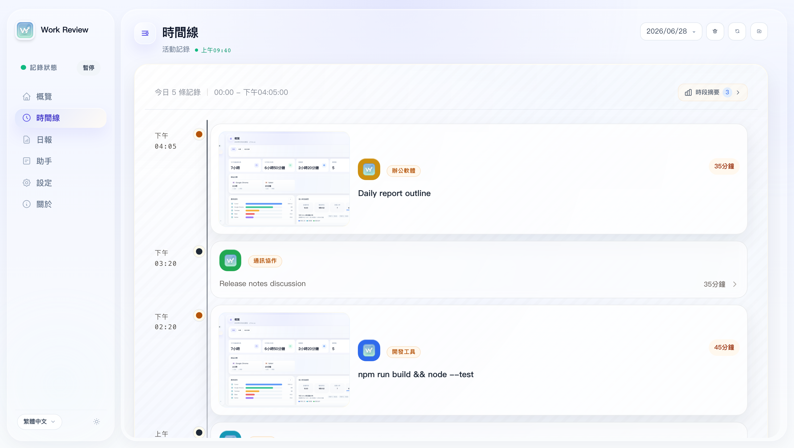
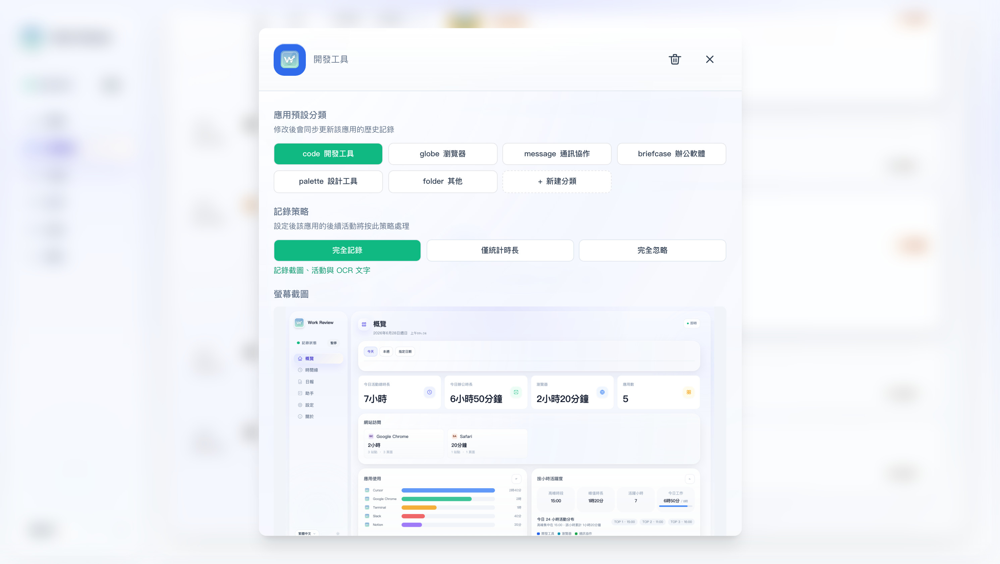
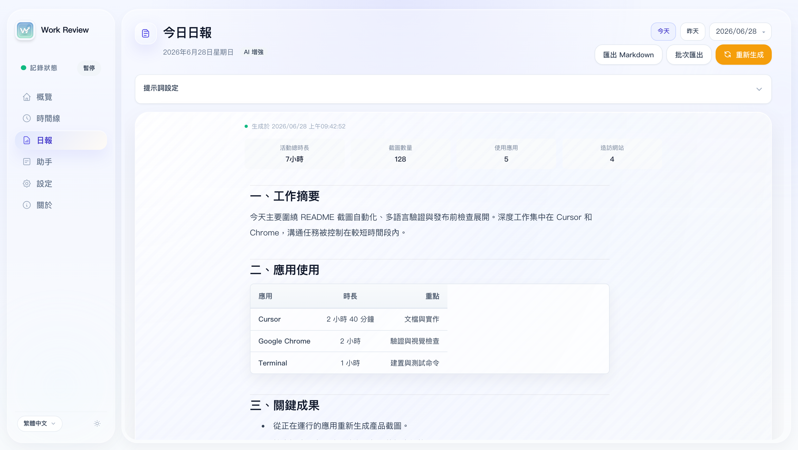
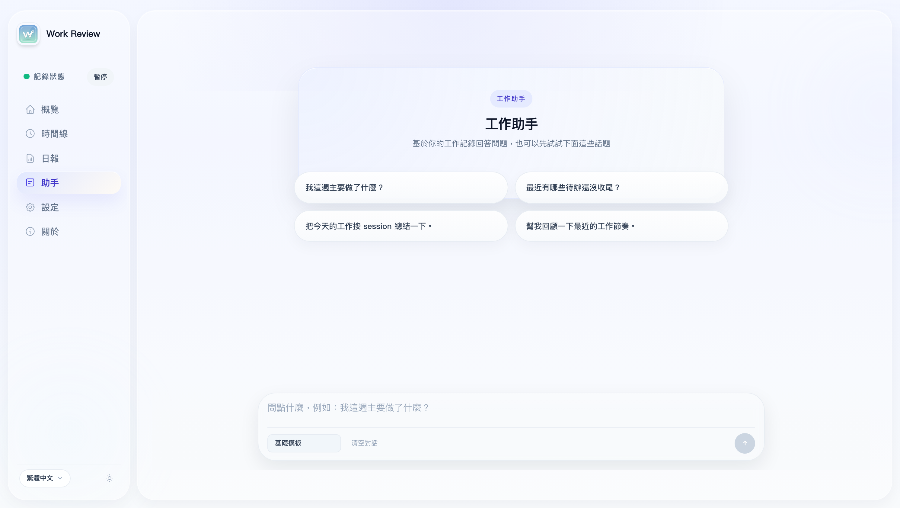
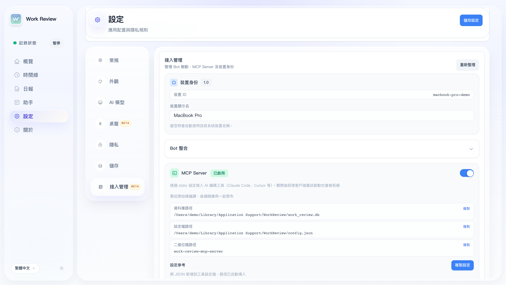
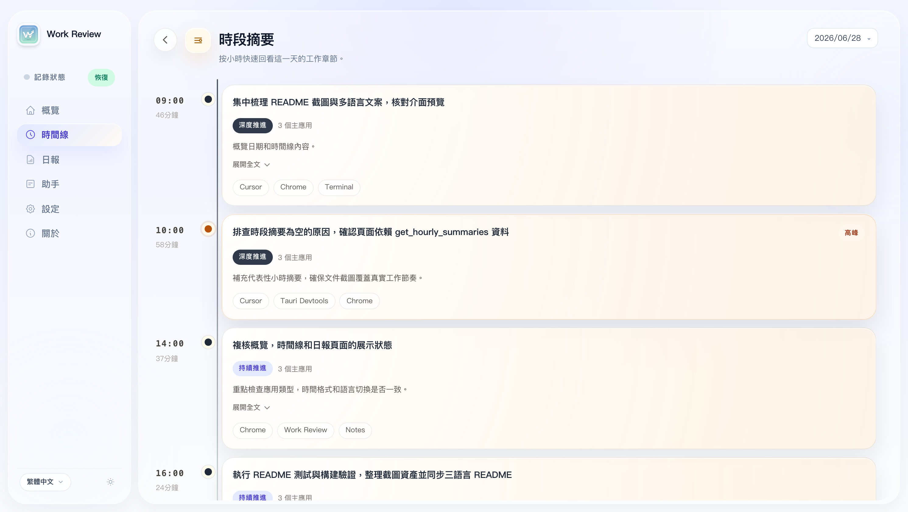
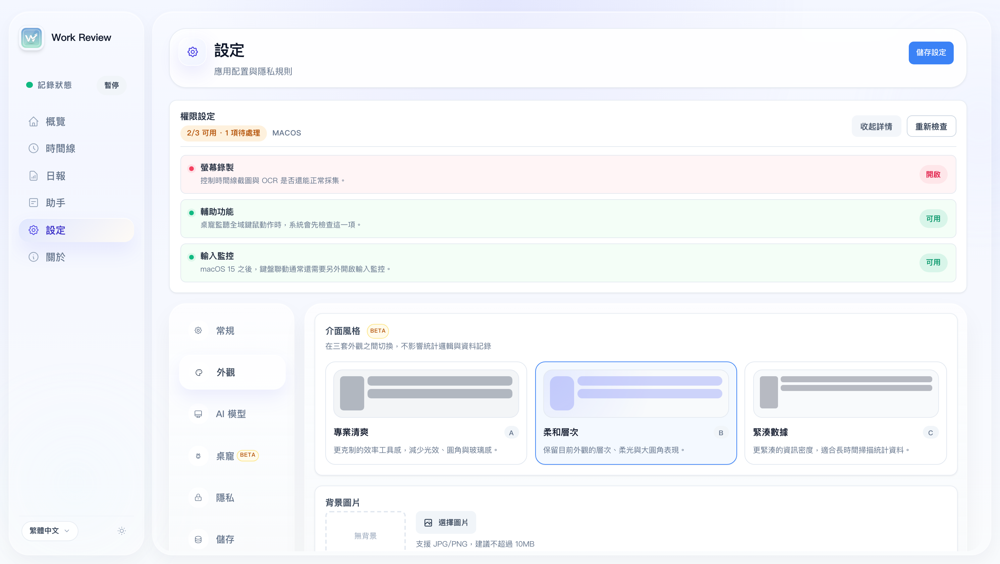
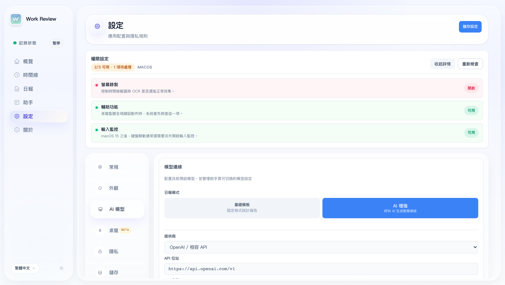
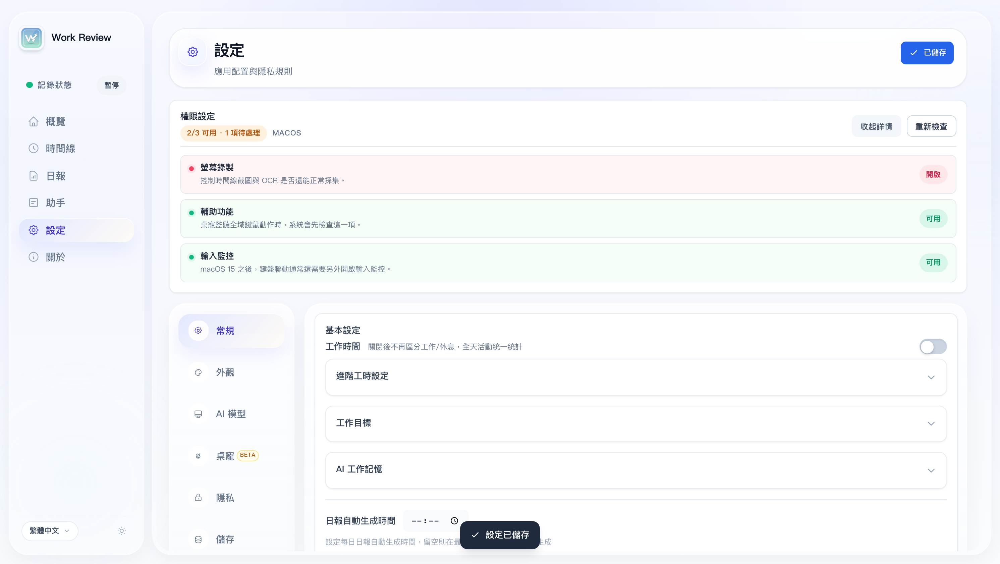
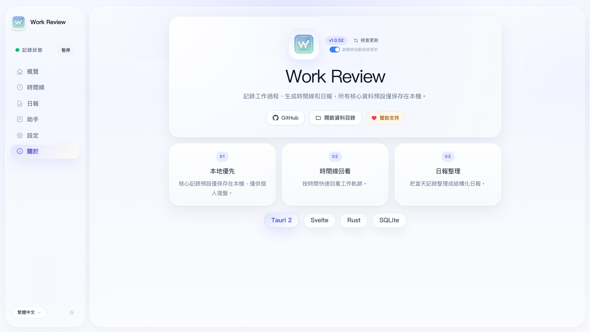

<p align="center">
  
</p>

<h1 align="center">Work Review</h1>

<p align="center">
  <strong>本地優先的個人工作回顧工具：自動記錄上下文，幫你復盤和產生日報。</strong>
</p>

<p align="center">
  自動整理你使用過的應用、訪問過的網站、窗口標題和可選截圖，把零散工作痕跡變成可回看、可統計、可追問的時間線。
</p>

<p align="center">
  所有數據默認僅保存在本地設備，不上傳任何伺服器。AI 功能完全可選；關閉後照常使用。
</p>

<p align="center">
  <strong>🔒 僅供個人使用 —— 所有資料只存在你的裝置上。</strong>
</p>

<p align="center">
  <a href="./README.md">English</a> · <a href="./README.zh.md">简体中文</a> · <strong>繁體中文</strong>
</p>

<p align="center">
  <a href="https://github.com/w0xking/Work-Review/releases/latest">
    
  </a>
  
  
  
</p>

---

## 它解決什麼問題

Work Review 面向個人工作復盤，適合用來回答這些問題：

- 我今天到底做了什麼？
- 這幾天主要在推進什麼？
- 某個任務大概花了多少時間？
- 我當時看過哪個頁面、哪個窗口、哪些上下文？
- 今天的日報怎麼快速整理出來？

它的重點不是「監督」，而是幫助你**回憶、整理和復盤**自己的工作過程。

---

## 核心能力

- **自動記錄工作上下文** — 記錄前台應用、瀏覽器頁面、窗口標題、使用時長、可選截圖和 OCR 文本，減少手動補記
- **統一時間線和統計** — 概覽、時間線、工作助手、日報共用同一份本地記錄，既能看趨勢，也能追到具體上下文
- **本地記錄問答** — 用基礎模板或你配置的模型回答「今天做了什麼」「某個任務花了多久」「最近在推進什麼」等問題
- **日報生成與匯出** — 生成結構化日報，支援 Markdown 匯出、自動匯出、段落編輯、釘選/隱藏和 AI 編排順序
- **隱私優先，本地可控** — 數據默認保存在本地 SQLite；AI 可不啟用，模型調用使用你自己的 API Key，不經第三方中轉
- **桌面化身 Beta** — 用桌面化身反饋工作狀態，並逐步擴展到主動提醒和上下文輔助

---

## 界面預覽

以下截圖由本地運行中的桌面應用自動截取，使用對應語言界面和代表性的本地數據，覆蓋主要工作流和配置界面。

### 核心工作流

<p align="center">
  
</p>

<p align="center"><strong>概覽</strong></p>
<p align="center">
  
</p>

<p align="center"><strong>時間線</strong></p>
<p align="center">
  
</p>

<p align="center"><strong>時間線詳情</strong></p>
<p align="center">
  
</p>

<p align="center"><strong>日報</strong></p>
<p align="center">
  
</p>

<p align="center"><strong>工作助手</strong></p>
<p align="center">
  
</p>

<p align="center"><strong>接入管理</strong></p>
<p align="center">
  
</p>

<details>
<summary>更多截圖：小時總結、設置與關於頁</summary>

<p align="center"><strong>小時總結</strong></p>
<p align="center">
  
</p>

<p align="center"><strong>通用設置</strong></p>
<p align="center">
  
</p>

<p align="center"><strong>外觀設置</strong></p>
<p align="center">
  
</p>

<p align="center"><strong>AI 模型</strong></p>
<p align="center">
  
</p>

<p align="center"><strong>桌面化身</strong></p>
<p align="center">
  
</p>

<p align="center"><strong>隱私設置</strong></p>
<p align="center">
  
</p>

<p align="center"><strong>存儲設置</strong></p>
<p align="center">
  
</p>

<p align="center"><strong>關於</strong></p>
<p align="center">
  
</p>

</details>

---

## 隱私與邊界

Work Review 從設計上面向個人使用，不適用於：員工監控 · 團隊考勤 · 績效考核 · 隱形追蹤

你可以按需控制記錄範圍：

- 按應用設置為「正常 / 脫敏 / 忽略」，脫敏模式自動跳過截圖和 OCR
- 敏感關鍵詞自動過濾 · 域名黑名單
- 鎖屏自動暫停 · 手動暫停/恢復
- AI 僅在你主動配置模型後啟用，默認關閉

---

## 功能概覽

### 自動記錄

- 前台應用、窗口標題、瀏覽器 URL、使用時長和分類記錄
- 可選截圖與 OCR，支援多屏策略
- 鍵鼠活動 + 螢幕變化空閒檢測，減少掛機誤記
- 時間線回看任意時段的頁面、窗口和上下文

### 智能整理

- 工作助手基於本地記錄問答，支援基礎模板、AI 增強，以及配置模型後顯示動態開場提示
- 支援時長統計、分類篩選、趨勢對比、自然語言時間範圍，並可按今日、本週、指定日期、日期範圍查看小時活躍度
- 碎片活動聚合為連續工作 Session
- 從頁面、窗口標題和上下文中提煉可能的後續待辦

### 日報與復盤

- 結構化日報、歷史回看、Markdown 匯出與自動匯出
- 按小時活躍度、時間分配、應用使用、網站訪問等統計區塊
- 段落級釘選/隱藏/恢復，AI 編排順序可快取復用
- AI 增強下的附加提示詞和自定義模型
- 網站語義分類：修改域名分類後自動回填歷史
- 多段工作時間：如上午 + 下午，休息時間不計入

---

## AI 模式

Work Review 的核心始終是**本地記錄**。AI 的作用是讓記錄更容易閱讀和復盤，而不是使用前提。

| 模式 | 說明 |
|------|------|
| **基礎模板** | 零配置，輸出穩定的結構化結果 |
| **AI 增強** | 調用你自行配置的模型服務，讓問答和總結更自然 |

支持的提供商：Ollama (本地) / OpenAI 兼容 / DeepSeek / 通義千問 / 智譜 / Kimi / 豆包 / MiniMax / SiliconFlow / Gemini / Claude

---

## 快速開始

1. 從 [Releases](https://github.com/w0xking/Work-Review/releases/latest) 下載對應平台安裝包
2. macOS 需授予螢幕錄製、輔助功能權限
3. 保持後台運行一段時間
4. 回到概覽 / 時間線 / 日報查看當天記錄

| 平台 | 安裝包 |
|------|--------|
| macOS (Apple Silicon / Intel) | `.dmg` |
| Windows | `.exe` / 便攜版 `.zip` |
| Linux x86_64 (X11 / Wayland) | `.deb` / `.AppImage` |
| Linux ARM64 (aarch64) | `.deb` |

**macOS：** 截圖需「螢幕錄製」權限，桌寵聯動需「輔助功能 + 輸入監控」。首次提示"已損壞"時：`sudo xattr -rd com.apple.quarantine "/Applications/Work Review.app"`

**Windows：** 依賴 Microsoft Edge WebView2 Runtime。

**Linux：** 截圖和窗口追蹤依賴當前會話類型與工具鏈。<details><summary>依賴說明</summary>

```bash
# 基礎
sudo apt install xprintidle tesseract-ocr
# X11
sudo apt install xdotool x11-utils scrot
# Wayland: gdbus (GNOME) / kdotool (KDE) / swaymsg (Sway) / hyprctl (Hyprland)
# 截圖: grim / gnome-screenshot / spectacle
```

</details>

Ubuntu 24.04 / 24.10 Wayland (GNOME 46–47) 用戶如遇截圖閃屏/快門聲問題，可使用一鍵安裝腳本自動修復：

```bash
bash scripts/deb/reinstall.sh      # deb 方案（推薦）
bash scripts/deb/reinstall.sh --dry-run  # 預覽操作
```

詳見 [scripts/ubuntu-wayland-README.md](scripts/ubuntu-wayland-README.md)。

**KDE Plasma / Wayland 啟動崩潰（Fedora、Arch、openSUSE 等）：** 若應用啟動後立即退出並報 `Gdk-Message: Error 71 (Protocol error) dispatching to Wayland display.`，這是 webkit2gtk/GTK 在 Wayland 下的上游缺陷（見 [tauri#10702](https://github.com/tauri-apps/tauri/issues/10702)），在 KDE Plasma + NVIDIA 上最常見。新版本已在啟動時自動注入 `WEBKIT_DISABLE_DMABUF_RENDERER=1`。舊版本若仍崩潰，優先手動用同一個 workaround 啟動：

```bash
WEBKIT_DISABLE_DMABUF_RENDERER=1 ./Work_Review
```

如果仍無法啟動，再強制走 X11 後端作為最後兜底。部分 Wayland 桌面下 X11 兜底可能會出現渲染異常：

```bash
GDK_BACKEND=x11 ./Work_Review
```

---

## 擴展能力（Beta）

<details>
<summary>桌面化身</summary>

用獨立桌寵窗口反饋待機/辦公/閱讀/會議/音樂/視頻等狀態。


當前仍在持續完善中，會繼續改進交互聯動、狀態表達和預設細節。

</details>

<details>
<summary>Bot 聯動（Telegram / 飛書）</summary>

通過本地 API + 多設備註冊，從 Telegram / 飛書遠端查詢記錄與生成日報。支持命令：`/devices`、`/report`、`/generate` 等。僅限個人和本人多設備聯動使用。

</details>

<details>
<summary>Localhost API</summary>

開啟 Localhost API 後，應用會在本地開放 HTTP API（預設 `127.0.0.1:47831`），鑑權方式為 Bearer Token（首次啟動自動產生，儲存在資料目錄的 `localhost_api_token.txt`）。

### 認證

所有請求（`/health` 與飛書回呼除外）需攜帶 Token：

```
Authorization: Bearer <token>
```

或透過 Query 參數：`?token=<token>`

### 接口列表

| 方法 | 路徑 | 說明 |
|------|------|------|
| GET | `/health` | 健康檢查（免鑑權） |
| GET | `/v1/device` | 設備資訊 |
| GET | `/v1/timeline/{date}` | 時間線（`date` 格式 `YYYY-MM-DD`，支援 `?limit=&offset=`） |
| GET | `/v1/activities/{date}` | 活動列表（支援 `?limit=&offset=&category=`） |
| GET | `/v1/stats/today` | 今日統計 |
| GET | `/v1/stats/overview` | 綜合統計（`?mode=today|date|week|range`） |
| GET | `/v1/stats/daily/{date}` | 指定日期統計 |
| GET | `/v1/reports` | 日報列表（`?limit=`） |
| GET | `/v1/reports/{date}` | 指定日期日報（`?locale=`） |
| GET | `/v1/reports/generate` | 產生日報（`?date=&locale=&force=true`） |
| POST | `/v1/reports/export-markdown` | 匯出日報 Markdown（body: `{ date, locale }`） |
| GET | `/v1/apps/recent` | 最近使用的應用 |
| GET | `/v1/apps/category-overview` | 應用分類概覽 |
| GET | `/v1/categories` | 應用分類列表 |
| GET | `/v1/categories/semantic` | 語義分類列表 |
| GET | `/v1/hourly-summaries/{date}` | 每小時彙總 |
| GET | `/v1/hourly-app-breakdown/{date}` | 每小時應用分佈 |
| GET | `/v1/weekly-review` | 週報（`?date_from=&date_to=&limit=`） |
| GET | `/v1/storage/stats` | 儲存統計 |

### 範例

```bash
# 取得今日時間線
curl -H "Authorization: Bearer $(cat ~/work-review/localhost_api_token.txt)" \
  http://127.0.0.1:47831/v1/timeline/2026-05-20

# 產生日報
curl -H "Authorization: Bearer $(cat ~/work-review/localhost_api_token.txt)" \
  "http://127.0.0.1:47831/v1/reports/generate?date=2026-05-20"
```

</details>

<details>
<summary>MCP Server</summary>

通過 stdio 協議將工作記錄接入 AI 編碼工具（Claude Code / Cursor / VS Code Copilot 等）。

```bash
cargo build --release -p work-review-mcp-server
```

```json
{
  "mcpServers": {
    "work-review": {
      "command": "/path/to/work-review-mcp-server",
      "env": {
        "WORK_REVIEW_DB_PATH": "/path/to/work_review.db",
        "WORK_REVIEW_CONFIG_PATH": "/path/to/config.json"
      }
    }
  }
}
```

</details>

---

## 開發

```bash
npm install
npm run tauri:dev    # 開發
npm run tauri:build  # 構建
```

要求：Node.js 18+ / Rust stable / Tauri 2 CLI · 技術棧：Tauri 2 + Rust + Svelte 4 + SQLite

---

## 社群交流

<p align="center"><strong>微信群</strong></p>

<p align="center">
  
</p>

<p align="center"><small>如果二維碼失效，關注下方公眾號獲取最新進群方式，或者進 TG 群吐槽</small></p>

---

<p align="center"><strong>公眾號</strong></p>

<p align="center">
  
</p>

---

<p align="center">
  <a href="https://t.me/+stYJLlkZbDYwM2Rl"></a>
</p>

## 致謝

- 感謝 [linux.do](https://linux.do/) 社區的交流與討論支持
- 桌面化身 BongoCat 資源改編自 [ayangweb/BongoCat](https://github.com/ayangweb/BongoCat) (MIT License)，詳見 [THIRD_PARTY_NOTICES.md](THIRD_PARTY_NOTICES.md)

## License

[MIT](./LICENSE) © 2026 wm94i

---

## 歷史星標

<a href="https://www.star-history.com/#wm94i/Work-Review&Date">
  <picture>
    <source media="(prefers-color-scheme: dark)" srcset="https://api.star-history.com/svg?repos=wm94i/Work-Review&type=Date&theme=dark" />
    <source media="(prefers-color-scheme: light)" srcset="https://api.star-history.com/svg?repos=wm94i/Work-Review&type=Date" />
    
  </picture>
</a>
