<p align="center">
  
</p>

<h1 align="center">Work Review</h1>

<p align="center">
  <strong>本地优先的个人工作回顾工具：自动记录上下文，帮你复盘和生成日报。</strong>
</p>

<p align="center">
  自动整理你使用过的应用、访问过的网站、窗口标题和可选截图，把零散工作痕迹变成可回看、可统计、可追问的时间线。
</p>

<p align="center">
  所有数据默认仅保存在本地设备，不上传任何服务器。AI 功能完全可选；关闭后照常使用。
</p>

<p align="center">
  <strong>🔒 仅供个人使用 —— 所有数据只存在你的设备上。</strong>
</p>

<p align="center">
  <a href="./README.md">English</a> · <strong>简体中文</strong> · <a href="./README.tw.md">繁體中文</a>
</p>

<p align="center">
  <a href="https://github.com/w0xking/Work-Review/releases/latest">
    
  </a>
  
  
  
</p>

---

## 它解决什么问题

Work Review 面向个人工作复盘，适合用来回答这些问题：

- 我今天到底做了什么？
- 这几天主要在推进什么？
- 某个任务大概花了多少时间？
- 我当时看过哪个页面、哪个窗口、哪些上下文？
- 今天的日报怎么快速整理出来？

它的重点不是“监督”，而是帮助你**回忆、整理和复盘**自己的工作过程。

---

## 核心能力

- **自动记录工作上下文** — 记录前台应用、浏览器页面、窗口标题、使用时长、可选截图和 OCR 文本，减少手动补记
- **统一时间线和统计** — 概览、时间线、工作助手、日报共用同一份本地记录，既能看趋势，也能追到具体上下文
- **本地记录问答** — 用基础模板或你配置的模型回答“今天做了什么”“某个任务花了多久”“最近在推进什么”等问题
- **日报生成与导出** — 生成结构化日报，支持 Markdown 导出、自动导出、段落编辑、钉选/隐藏和 AI 编排顺序
- **隐私优先，本地可控** — 数据默认保存在本地 SQLite；AI 可不启用，模型调用使用你自己的 API Key，不经第三方中转
- **桌面化身 Beta** — 用桌面化身反馈工作状态，并逐步扩展到主动提醒和上下文辅助

---

## 界面预览

以下截图由本地运行中的桌面应用自动截取，使用对应语言界面和代表性的本地数据，覆盖主要工作流和配置界面。

### 核心工作流

<p align="center">
  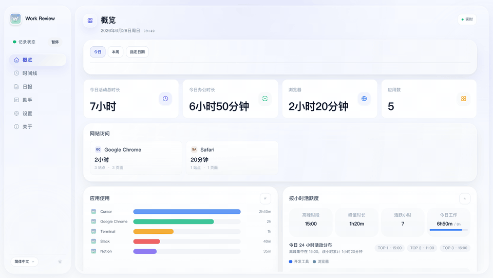
</p>

<p align="center"><strong>概览</strong></p>
<p align="center">
  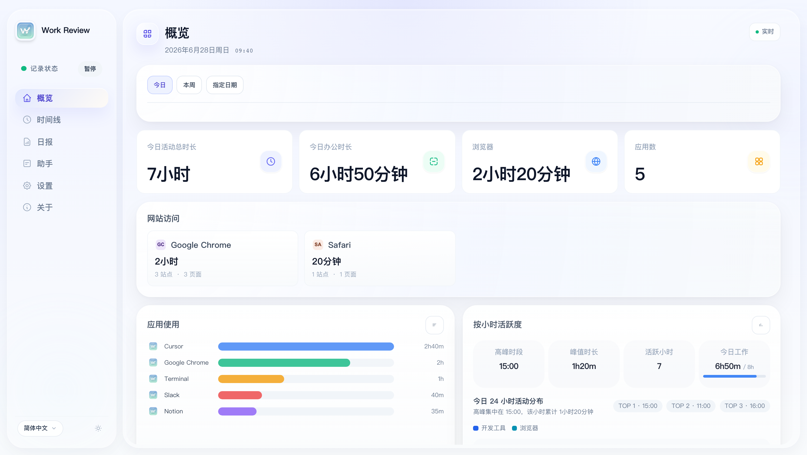
</p>

<p align="center"><strong>时间线</strong></p>
<p align="center">
  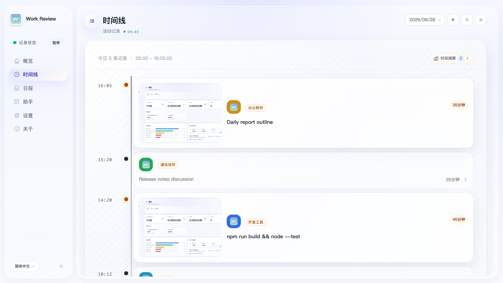
</p>

<p align="center"><strong>时间线详情</strong></p>
<p align="center">
  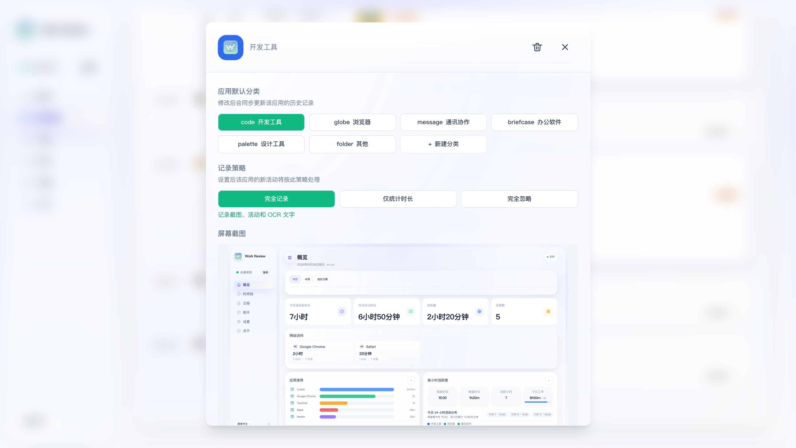
</p>

<p align="center"><strong>日报</strong></p>
<p align="center">
  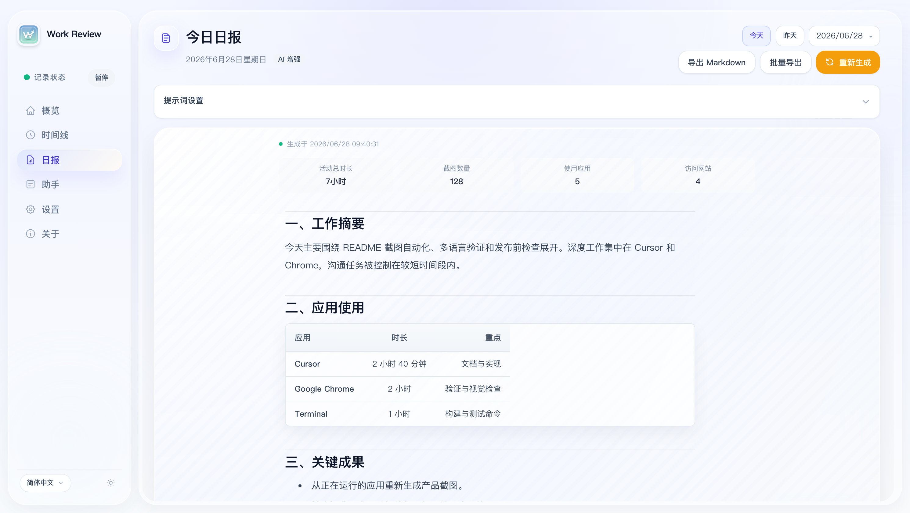
</p>

<p align="center"><strong>工作助手</strong></p>
<p align="center">
  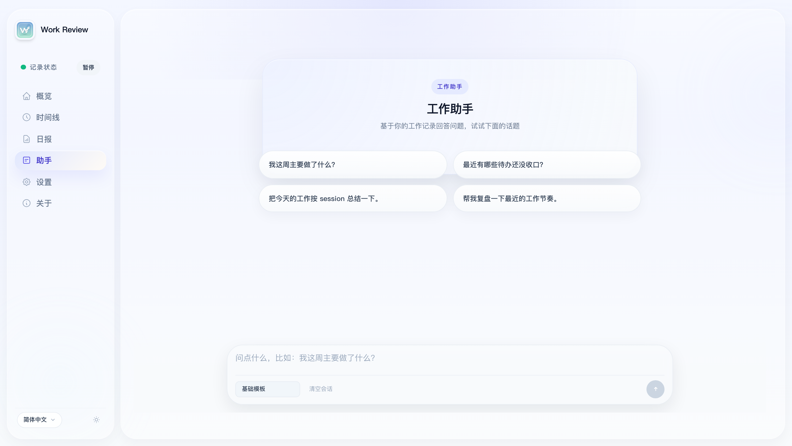
</p>

<p align="center"><strong>接入管理</strong></p>
<p align="center">
  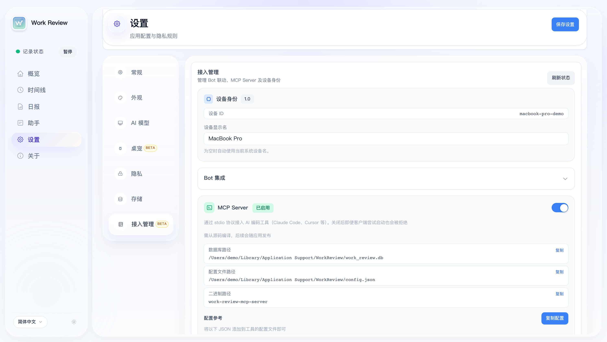
</p>

<details>
<summary>更多截图：小时总结、设置与关于页</summary>

<p align="center"><strong>小时总结</strong></p>
<p align="center">
  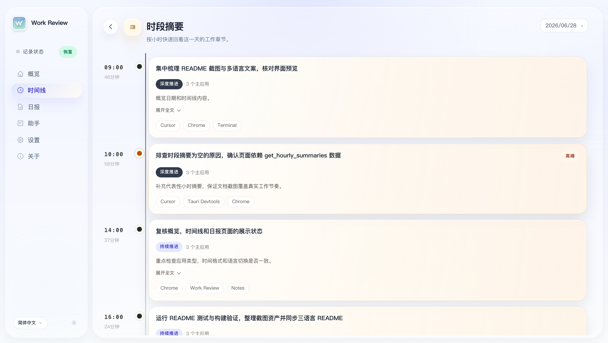
</p>

<p align="center"><strong>通用设置</strong></p>
<p align="center">
  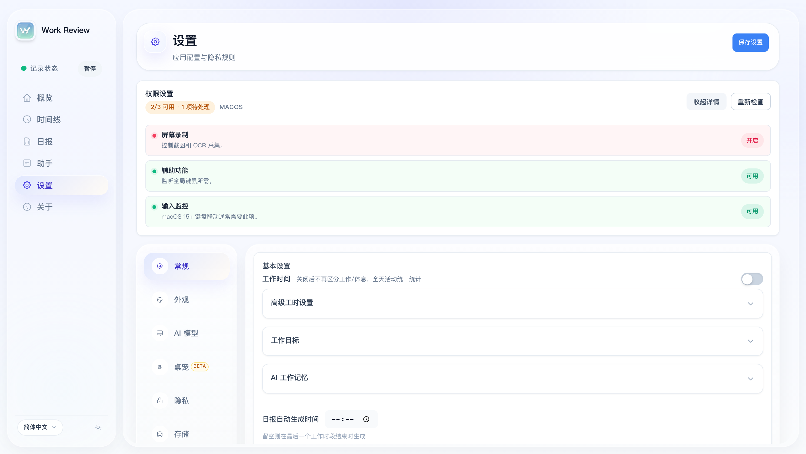
</p>

<p align="center"><strong>外观设置</strong></p>
<p align="center">
  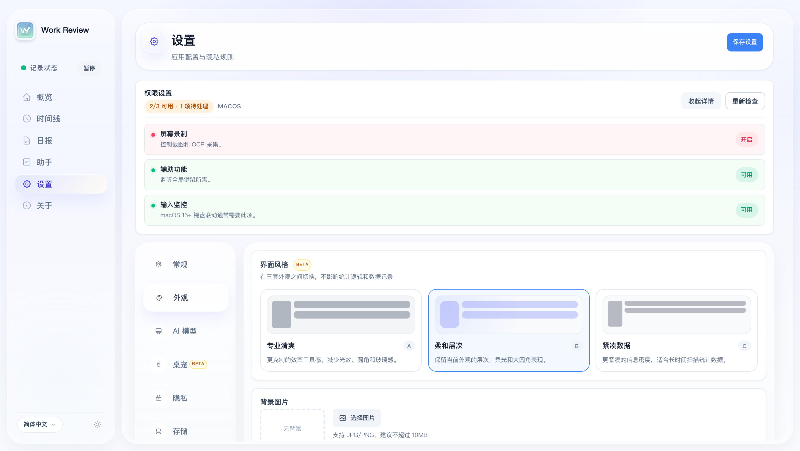
</p>

<p align="center"><strong>AI 模型</strong></p>
<p align="center">
  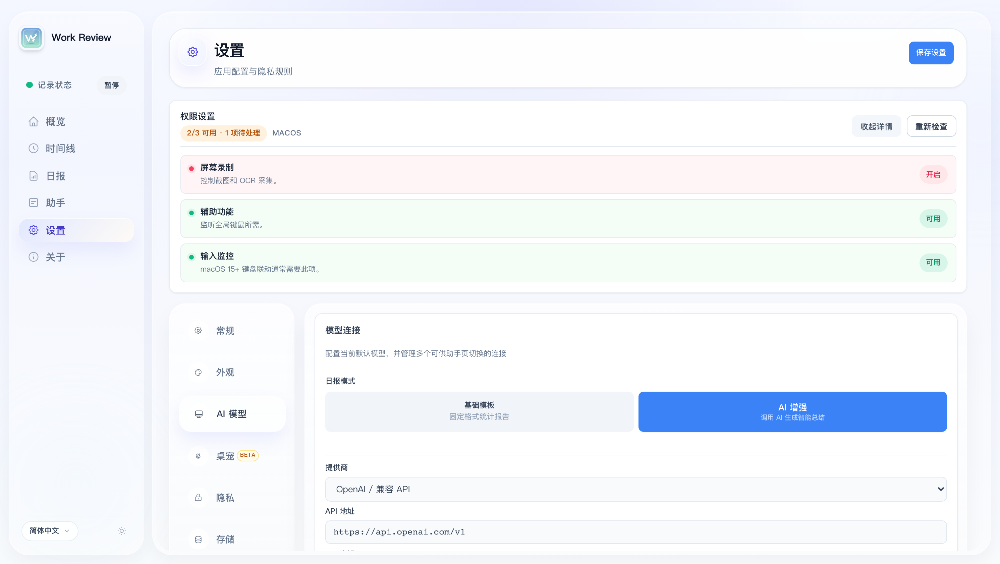
</p>

<p align="center"><strong>桌面化身</strong></p>
<p align="center">
  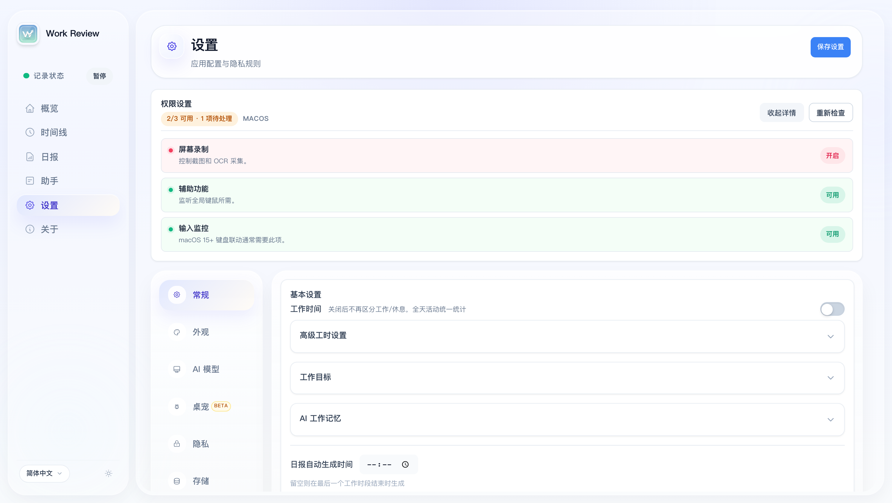
</p>

<p align="center"><strong>隐私设置</strong></p>
<p align="center">
  
</p>

<p align="center"><strong>存储设置</strong></p>
<p align="center">
  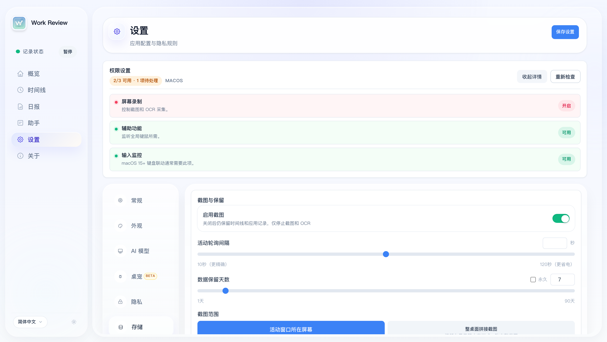
</p>

<p align="center"><strong>关于</strong></p>
<p align="center">
  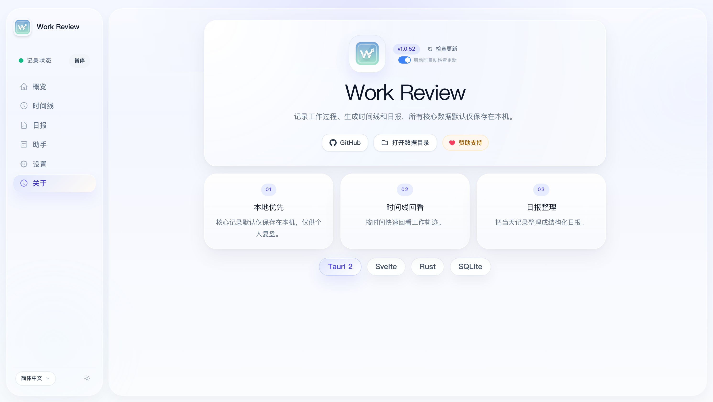
</p>

</details>

---

## 隐私与边界

Work Review 从设计上面向个人使用，不适用于：员工监控 · 团队考勤 · 绩效考核 · 隐形追踪

你可以按需控制记录范围：

- 按应用设置为「正常 / 脱敏 / 忽略」，脱敏模式自动跳过截图和 OCR
- 敏感关键词自动过滤 · 域名黑名单
- 锁屏自动暂停 · 手动暂停/恢复
- AI 仅在你主动配置模型后启用，默认关闭

---

## 功能概览

### 自动记录

- 前台应用、窗口标题、浏览器 URL、使用时长和分类记录
- 可选截图与 OCR，支持多屏策略
- 键鼠活动 + 屏幕变化空闲检测，减少挂机误记
- 时间线回看任意时段的页面、窗口和上下文

### 智能整理

- 工作助手基于本地记录问答，支持基础模板、AI 增强，以及配置模型后显示动态开场提示
- 支持时长统计、分类筛选、趋势对比、自然语言时间范围，并可按今日、本周、指定日期、日期范围查看小时活跃度
- 碎片活动聚合为连续工作 Session
- 从页面、窗口标题和上下文中提炼可能的后续待办

### 日报与复盘

- 结构化日报、历史回看、Markdown 导出与自动导出
- 按小时活跃度、时间分配、应用使用、网站访问等统计区块
- 段落级钉选/隐藏/恢复，AI 编排顺序可缓存复用
- AI 增强下的附加提示词和自定义模型
- 网站语义分类：修改域名分类后自动回填历史
- 多段工作时间：如上午 + 下午，休息时间不计入

---

## AI 模式

Work Review 的核心始终是**本地记录**。AI 的作用是让记录更容易阅读和复盘，而不是使用前提。

| 模式 | 说明 |
|------|------|
| **基础模板** | 零配置，输出稳定的结构化结果 |
| **AI 增强** | 调用你自行配置的模型服务，让问答和总结更自然 |

支持的提供商：Ollama (本地) / OpenAI 兼容 / DeepSeek / 通义千问 / 智谱 / Kimi / 豆包 / MiniMax / SiliconFlow / Gemini / Claude

---

## 快速开始

1. 从 [Releases](https://github.com/w0xking/Work-Review/releases/latest) 下载对应平台安装包
2. macOS 需授予屏幕录制、辅助功能权限
3. 保持后台运行一段时间
4. 回到概览 / 时间线 / 日报查看当天记录

| 平台 | 安装包 |
|------|--------|
| macOS (Apple Silicon / Intel) | `.dmg` |
| Windows | `.exe` / 便携版 `.zip` |
| Linux x86_64 (X11 / Wayland) | `.deb` / `.AppImage` |
| Linux ARM64 (aarch64) | `.deb` |

**macOS：** 截图需「屏幕录制」权限，桌宠联动需「辅助功能 + 输入监控」。首次提示"已损坏"时：`sudo xattr -rd com.apple.quarantine "/Applications/Work Review.app"`

**Windows：** 依赖 Microsoft Edge WebView2 Runtime。

**Linux：** 截图和窗口追踪依赖当前会话类型与工具链。<details><summary>依赖说明</summary>

```bash
# 基础
sudo apt install xprintidle tesseract-ocr
# X11
sudo apt install xdotool x11-utils scrot
# Wayland: gdbus (GNOME) / kdotool (KDE) / swaymsg (Sway) / hyprctl (Hyprland)
# 截图: grim / gnome-screenshot / spectacle
```

</details>

Ubuntu 24.04 / 24.10 Wayland (GNOME 46–47) 用户如遇截图闪屏/快门声问题，可使用一键安装脚本自动修复：

```bash
bash scripts/deb/reinstall.sh      # deb 方案（推荐）
bash scripts/deb/reinstall.sh --dry-run  # 预览操作
```

详见 [scripts/ubuntu-wayland-README.md](scripts/ubuntu-wayland-README.md)。

**KDE Plasma / Wayland 启动崩溃（Fedora、Arch、openSUSE 等）：** 若应用启动后立即退出并报 `Gdk-Message: Error 71 (Protocol error) dispatching to Wayland display.`，这是 webkit2gtk/GTK 在 Wayland 下的上游缺陷（见 [tauri#10702](https://github.com/tauri-apps/tauri/issues/10702)），在 KDE Plasma + NVIDIA 上最常见。新版本已在启动时自动注入 `WEBKIT_DISABLE_DMABUF_RENDERER=1`。旧版本若仍崩溃，优先手动用同一个 workaround 启动：

```bash
WEBKIT_DISABLE_DMABUF_RENDERER=1 ./Work_Review
```

如果仍无法启动，再强制走 X11 后端作为最后兜底。部分 Wayland 桌面下 X11 兜底可能会出现渲染异常：

```bash
GDK_BACKEND=x11 ./Work_Review
```

---

## 扩展能力（Beta）

<details>
<summary>桌面化身</summary>

用独立桌宠窗口反馈待机/办公/阅读/会议/音乐/视频等状态。


当前仍在持续完善中，会继续改进交互联动、状态表达和预设细节。

</details>

<details>
<summary>Bot 联动（Telegram / 飞书）</summary>

通过本地 API + 多设备注册，从 Telegram / 飞书远程查询记录与生成日报。支持命令：`/devices`、`/report`、`/generate` 等。仅限个人和本人多设备联动使用。

</details>

<details>
<summary>Localhost API</summary>

开启 Localhost API 后，应用会在本地开放 HTTP API（默认 `127.0.0.1:47831`），鉴权方式为 Bearer Token（首次启动自动生成，保存在数据目录的 `localhost_api_token.txt`）。

### 认证

所有请求（`/health` 和飞书回调除外）需携带 Token：

```
Authorization: Bearer <token>
```

或通过 Query 参数：`?token=<token>`

### 接口列表

| 方法 | 路径 | 说明 |
|------|------|------|
| GET | `/health` | 健康检查（免鉴权） |
| GET | `/v1/device` | 设备信息 |
| GET | `/v1/timeline/{date}` | 时间线（`date` 格式 `YYYY-MM-DD`，支持 `?limit=&offset=`） |
| GET | `/v1/activities/{date}` | 活动列表（支持 `?limit=&offset=&category=`） |
| GET | `/v1/stats/today` | 今日统计 |
| GET | `/v1/stats/overview` | 综合统计（`?mode=today|date|week|range`） |
| GET | `/v1/stats/daily/{date}` | 指定日期统计 |
| GET | `/v1/reports` | 日报列表（`?limit=`） |
| GET | `/v1/reports/{date}` | 指定日期日报（`?locale=`） |
| GET | `/v1/reports/generate` | 生成日报（`?date=&locale=&force=true`） |
| POST | `/v1/reports/export-markdown` | 导出日报 Markdown（body: `{ date, locale }`） |
| GET | `/v1/apps/recent` | 最近使用的应用 |
| GET | `/v1/apps/category-overview` | 应用分类概览 |
| GET | `/v1/categories` | 应用分类列表 |
| GET | `/v1/categories/semantic` | 语义分类列表 |
| GET | `/v1/hourly-summaries/{date}` | 按小时汇总 |
| GET | `/v1/hourly-app-breakdown/{date}` | 按小时应用分布 |
| GET | `/v1/weekly-review` | 周报（`?date_from=&date_to=&limit=`） |
| GET | `/v1/storage/stats` | 存储统计 |

### 示例

```bash
# 获取今日时间线
curl -H "Authorization: Bearer $(cat ~/work-review/localhost_api_token.txt)" \
  http://127.0.0.1:47831/v1/timeline/2026-05-20

# 生成日报
curl -H "Authorization: Bearer $(cat ~/work-review/localhost_api_token.txt)" \
  "http://127.0.0.1:47831/v1/reports/generate?date=2026-05-20"
```

</details>

<details>
<summary>MCP Server</summary>

通过 stdio 协议将工作记录接入 AI 编码工具（Claude Code / Cursor / VS Code Copilot 等）。

```bash
cargo build --release -p work-review-mcp-server
```

```json
{
  "mcpServers": {
    "work-review": {
      "command": "/path/to/work-review-mcp-server",
      "env": {
        "WORK_REVIEW_DB_PATH": "/path/to/work_review.db",
        "WORK_REVIEW_CONFIG_PATH": "/path/to/config.json"
      }
    }
  }
}
```

</details>

---

## 开发

```bash
npm install
npm run tauri:dev    # 开发
npm run tauri:build  # 构建
```

要求：Node.js 18+ / Rust stable / Tauri 2 CLI · 技术栈：Tauri 2 + Rust + Svelte 4 + SQLite

---

## 社区交流

<p align="center"><strong>微信群</strong></p>

<p align="center">
  
</p>

<p align="center"><small>如果二维码失效，关注下方公众号获取最新进群方式，或者进 TG 群吐槽</small></p>

---

<p align="center"><strong>公众号</strong></p>

<p align="center">
  
</p>

---

<p align="center">
  <a href="https://t.me/+stYJLlkZbDYwM2Rl"></a>
</p>

## 致谢

- 感谢 [linux.do](https://linux.do/) 社区的交流与讨论支持
- 桌面化身 BongoCat 资源改编自 [ayangweb/BongoCat](https://github.com/ayangweb/BongoCat) (MIT License)，详见 [THIRD_PARTY_NOTICES.md](THIRD_PARTY_NOTICES.md)

## License

[MIT](./LICENSE) © 2026 wm94i

---

## 历史星标

<a href="https://www.star-history.com/#wm94i/Work-Review&Date">
  <picture>
    <source media="(prefers-color-scheme: dark)" srcset="https://api.star-history.com/svg?repos=wm94i/Work-Review&type=Date&theme=dark" />
    <source media="(prefers-color-scheme: light)" srcset="https://api.star-history.com/svg?repos=wm94i/Work-Review&type=Date" />
    
  </picture>
</a>
